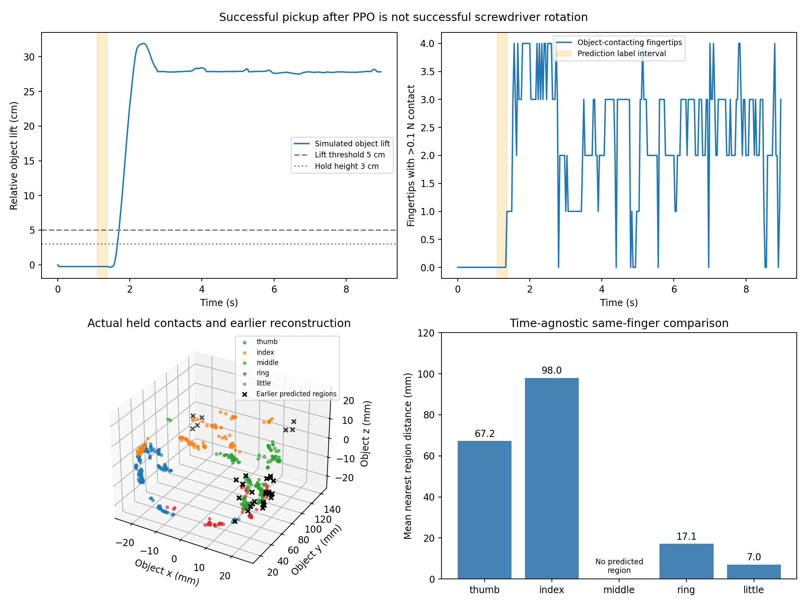

# C2Dex 接觸重建與成功拿取分析

本 repo 收錄 C2Dex 接觸重建與 retarget 的獨立實作，以及重建接觸點和成功拿取任務的模擬接觸點分析。實驗說明只納入達到各自拿取條件的案例，不用未成功拿取的軌跡比較接觸表現。

目前螺絲刀 baseline 經 PPO 微調後能抬升 31.9 cm、持握 7.33 秒。其持握接觸點與較早的重建區域，在同指、物體座標系下的平均最近距離為 67.3 mm。但持握階段沒有同步重建標籤，也缺少「有／無重建都成功拿取」的配對案例，因此不能宣稱重建改善 PPO 或把這個距離當成持握階段的預測準確率。

## 實驗與程式

- [實驗說明](docs/experiments.md)：螺絲刀 PPO、成功拿取的接觸點距離與重建改善的證據界限。
- [復現方法](docs/reproduction.md)：分析重跑、MANO 載入、重建、retarget 與 28 DOF PPO 接入。
- [資產與資料範圍](docs/data_policy.md)：哪些衍生資料已提供，哪些模型與原始資料須自行取得。
- [成功螺絲刀結果](results/screwdriver_success.json)與[接觸點資料](results/screwdriver_success.contacts.npz)。



## 重跑成功案例分析

不需要 GPU、Isaac Sim、MANO 模型或原始 ZIP，就能從附帶的衍生 trace 重算接觸距離。

```bash
python -m pip install -e '.[test]'
python -m analysis.successful_screwdriver
python -m pytest -q
```

重建或重新訓練需要額外取得合法的 MANO、robot 與軌跡資產，詳見復現方法。提供程式不代表已完成論文完整 pipeline：本輪螺絲刀使用 3D keypoint fit 與 proximity 接觸近似；PPO 是指定 dex-rl checkpoint 的有限預算微調，不是 C2Dex 原始 ManipTrans 訓練。

## 來源

框架參考 [C2Dex 論文](https://arxiv.org/abs/2608.07045v2)。PPO baseline 使用 [dex-rl 的指定分支](https://github.com/clearlab-sustech/dex-rl/tree/hand-and-tron2-RL-regrind-reward)，固定在 commit `5c409994e4e04fd131aa46ad8441480da025c7fd`。本 repo 的實驗數字來自附帶的量測資料，不是論文 benchmark 數字。
